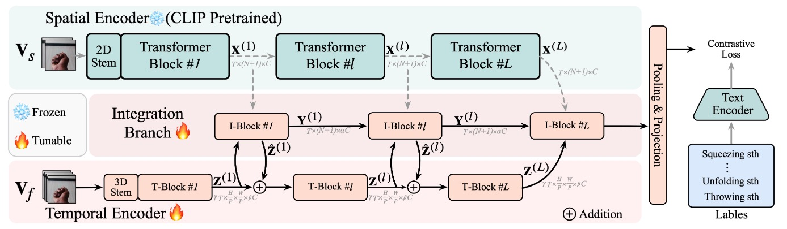

# Learning from Untrimmed Videos: Self-Supervised Video Representation Learning with Hierarchical Consistency
[Zhiwu Qing](https://scholar.google.com/citations?user=q9refl4AAAAJ&hl=zh-CN&authuser=1), [Shiwei Zhang](https://www.researchgate.net/profile/Shiwei-Zhang-14), [Ziyuan Huang](https://huang-ziyuan.github.io/), [Yi Xu](https://scholar.google.com/citations?user=D4jEMqEAAAAJ&hl=en), [Xiang Wang](https://scholar.google.com/citations?user=cQbXvkcAAAAJ&hl=zh-CN&oi=sra), Mingqian Tang,
[Rong Jin](https://www.cse.msu.edu/~rongjin/), [Changxin Gao](https://scholar.google.com/citations?user=4tku-lwAAAAJ&hl=zh-CN), [Nong Sang](https://scholar.google.com/citations?user=ky_ZowEAAAAJ&hl=zh-CN) <br/>
In CVPR, 2022. [[Paper]](https://openaccess.thecvf.com/content/CVPR2022/papers/Qing_Learning_From_Untrimmed_Videos_Self-Supervised_Video_Representation_Learning_With_Hierarchical_CVPR_2022_paper.pdf). [[Website]](https://hico-cvpr2022.github.io/)

<br/>
<div align="center">
    
</div>
<br/>

# Latest

[2022-08] Codes are available!

This repo is a modification on the [TAdaConv](https://github.com/alibaba-mmai-research/TAdaConv) repo.
## Installation

Requirements:
- Python>=3.6
- torch>=1.5
- torchvision (version corresponding with torch)
- simplejson==3.11.1
- decord>=0.6.0
- pyyaml
- einops
- oss2
- psutil
- tqdm
- pandas

optional requirements
- fvcore (for flops calculation)


# Data Preparation
The volume of a single long untrimmed video is often bulky, and it is inefficient to directly decode the long video. To improve pre-training efficiency, we recommend cutting long videos into multiple small clips (5s/clip) sequentially. Take the first training video (*i.e.,* v_--0edUL8zmA.mp4) in the HACS dataset as an example, the duration of this video is 92s, so the pre-training videos are expected to be in the `train/` folder:
```
/path/to/hacs-clips/
  train/
    # 1st video
    v_--0edUL8zmA_0000000_0005000.mp4
    v_--0edUL8zmA_0005000_0010000.mp4
    v_--0edUL8zmA_0010000_0015000.mp4
    v_--0edUL8zmA_0015000_0020000.mp4
    ...
    v_--0edUL8zmA_0085000_0090000.mp4
    v_--0edUL8zmA_0090000_0092120.mp4
    # 2nd video
    v_--8jh-DkPK4_0000000_0005000.mp4
    v_--8jh-DkPK4_0005000_0010000.mp4
    v_--8jh-DkPK4_0010000_0015000.mp4
    ...
    v_--8jh-DkPK4_0215000_0220000.mp4
    v_--8jh-DkPK4_0220000_0220420.mp4
    ...
```
We can observe that each video is segmented into multiple 5s duration segments, which can be easily achieved with FFMPEG. To facilitate decoding of multiple consecutive segments in pre-training, we also need to prepare an additional file that records the video name, start time and end time of each segment (*i.e,* `training.txt`):
```
--0edUL8zmA,0000000,0005000
--0edUL8zmA,0005000,0010000
--0edUL8zmA,0010000,0015000
--0edUL8zmA,0015000,0020000
...
--0edUL8zmA,0085000,0090000
--0edUL8zmA,0090000,0092120
--8jh-DkPK4,0000000,0005000
--8jh-DkPK4,0005000,0010000
--8jh-DkPK4,0010000,0015000
...
--8jh-DkPK4,0215000,0220000
--8jh-DkPK4,0220000,0220420
...
```
This file should be in the `cfg.DATA.ANNO_DIR` directory.
The [HACS dataset](https://github.com/hangzhaomit/HACS-dataset) is a large-scale untrimmed video dataset for temporal action localization task. Each video in this dataset contains at least one action category and one background. **If you have limited resources, we recommend validating your ideas on the HACS dataset first.** The untrimmed version of the [Kinetics400 dataset](https://github.com/chi0tzp/KineticX-Downloader) only needs to not cut the original videos.

# Model Zoo

We include our pre-trained models in the [MODEL_ZOO.md](MODEL_ZOO.md).


# Running instructions
To train the model with HiCo, set the `_BASE_RUN` to point to `configs/pool/run/training/simclr.yaml`. See `configs/projects/hico/simclr_*_s3dg.yaml` for more details. Alternatively, you can also find some pre-trained model in the `MODEL_ZOO.md`.

For detailed explanations on the approach itself, please refer to the [paper](https://openaccess.thecvf.com/content/CVPR2022/papers/).

For an example run, set the `DATA_ROOT_DIR` and `ANNO_DIR` in `configs/projects/hico/simclr_hacs_s3dg.yaml`, and `OUTPUT_DIR` in `configs/projects/hico/pt-hacs/s3dg-hico-s.yaml`, and run the command for the short pre-training(for ablation studies):
```
python runs/run.py --cfg configs/projects/hico/pt-hacs/s3dg-hico-s.yaml
```
Run this command for the long pre-training:
```
python runs/run.py --cfg configs/projects/hico/pt-hacs/s3dg-hico-l.yaml
```


# Citing HiCo
If you find HiCo useful for your research, please consider citing the paper as follows:
```BibTeX
@inproceedings{qing2022hico,
  title={Learning from Untrimmed Videos: Self-Supervised Video Representation Learning with Hierarchical Consistency},
  author={Qing, Zhiwu and Zhang, Shiwei and Huang, Ziyuan and Xu, Yi and Wang, Xiang and Tang, Mingqian and Gao, Changxin and Jin, Rong and Sang, Nong},
  booktitle={Proceedings of the IEEE/CVF Conference on Computer Vision and Pattern Recognition},
  pages={13821--13831},
  year={2022}
}
```
